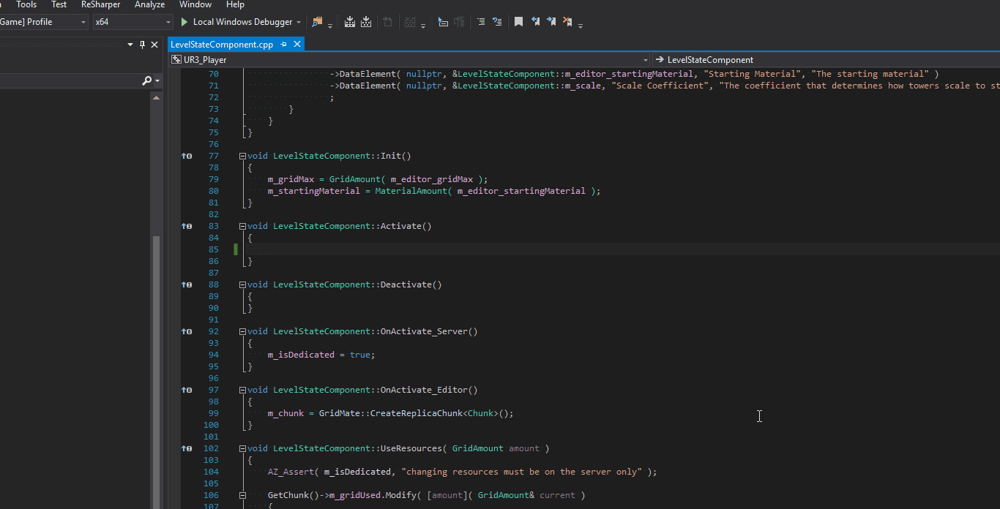

# buslint
A linter for Amazon's Lumberyard to catch common mistakes when using buses. Right now it reports when you forgot to connect a bus when handling it.

First, lets see it in action!


If this doesn't excite you, then you must be a god among programmers. Everyone knows that in Lumberyard, all runtime problems come down to forgetting to connect to a bus!

In the future, the goal will be to do more things. For now, buslint will check at compile time, if you are inheriting a bus handler and then check that you connect to that bus in the source.

## Installation

I'm not sure this is the best way to use WAF, so let me know if you know of a better way. However, it's not hard.

Click the releases link above (or just click [here](https://github.com/horvay/buslint/releases) ). 

Drop the `buslint.exe` into your `dev` folder, and drop the `buslint.py` into the `dev\Tools\build\waf-1.7.13\lmbrwaflib` folder. Note the version of waf may change in the future.

BOOM, you're donzies.

## Enabling buslint for a gem

You probably don't want this running on everything, especially the core Lumberyard Gems, so in order to enable it for a specific gem, add the following line to the wscript of said Gem.

```python
win_features = ['buslint']
```

So as an example, it may look like:
```python
def build(bld):
    bld.DefineGem(
        # Add custom build options here
        includes    = [bld.Path('Code/CryEngine/CryAction')],
        use                     = ['AzGameFramework', 'UR3_Enemies', 'UR3_Base', 'LightningArc'],
        vs_filter               = 'Gems/UR3',
        win_features            = ['buslint'],
    )
```

Now whenever the files of that gem change, it should rerun buslint on those files.

## But I don't want to connect to the bus; you can't make me you can't make me!

That's true, it's a free country. If you want buslint to ignore a specific bus, put `//nolint` after it
```cpp
class LevelStateComponent
    : public UR3_Base::NetworkComponent
    , public AzFramework::NetBindable
    , protected UR3_Base::ResourceRequestBus::Handler // nolint
```
The spacing around the `//` is optional.
